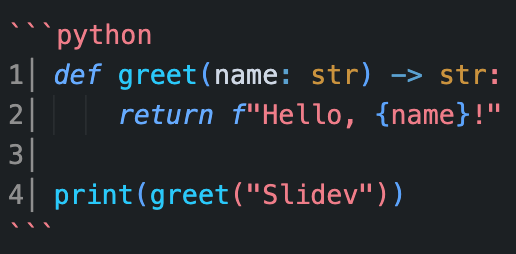
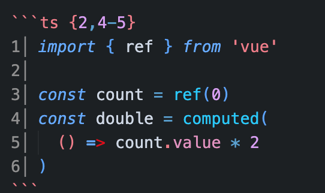
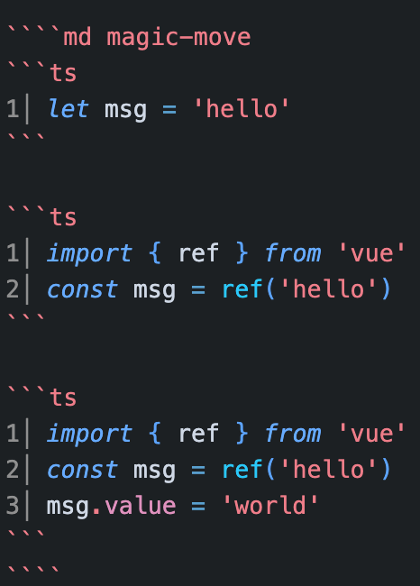
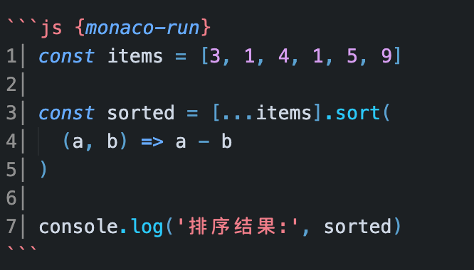

# 用Slidev轻松制作可互动演示
## 探索下一代基于开发者的幻灯片制作工具

<div class="pt-12">
  <span @click="$slidev.nav.next" class="px-2 py-1 rounded cursor-pointer" hover="bg-white bg-opacity-10">
    开始探索 <carbon:arrow-right class="inline"/>
  </span>
</div>

---
transition: fade-out
---

# 高级功能纵览

Slidev 专为开发者而生，内置了许多强大的功能，让演示不再枯燥。

- 🔢 **完整的数学公式支持** (LaTeX)
- 📝 **代码高亮与展示** (Shiki)
- 💻 **可编辑甚至可运行的代码块** (Monaco)
- 🧩 **任意使用Vue组件提升互动性**
- 🌟 **平滑炫酷的切换效果** (Vue Transition)

<br>
<br>

点击下方或者键盘方向键进行体验。

---
transition: slide-up
---

# 1. 优雅地插入公式 (Math Equations)

Slidev 原生支持 KaTeX，只需使用标准的 LaTeX 语法即可轻松渲染：

这是一个行内的公式：$E = mc^2$

这是一个独立的公式块：
$$
f(x) = \int_{-\infty}^\infty
    \hat f(\xi)\,e^{2 \pi i \xi x}
    \,d\xi
$$

**方程组示例：**
$$
\begin{cases}
a_1x+b_1y+c_1z=d_1 \\
a_2x+b_2y+c_2z=d_2 \\
a_3x+b_3y+c_3z=d_3
\end{cases}
$$

> 告别繁杂的插图截屏，一切尽在代码掌控之中！

---
transition: zoom
---

# 2. 精美的代码展示与幻影过渡动画

基于强大的 Shiki 引擎，不仅支持通过 `{all|1|4|all}` 控制**行高亮**，还能实现**Shiki Magic Move**，即多个代码状态之间不可思议的平滑形态过渡动画。

<div class="grid grid-cols-2 gap-8 text-sm">

<div>

**✨ 行级高亮演示**

```ts {all|1|4|all}
// 请在键盘按下右键，体验逐行高亮
import { ref } from 'vue'

const message = ref('Hello')

console.log(message.value)
```

</div>

<div>

**🎩 Shiki Magic Move**

````md magic-move
```ts
// 之后是 Magic Move 动画阶段
let message = 'Magic Move'
```

```ts
// 元素会自动打乱并平滑过渡到新位置
import { ref } from 'vue'

const message = ref('Magic Move')
```

```ts
// 极其完美的变量演变展示
import { ref } from 'vue'

const message = ref('Magic Move')
message.value = 'Is Awesome!'
```
````

</div>

</div>

> **小贴士**：在这页里随着你的点击，左侧先完成行高亮，之后右侧开始代码形态变形！

---
transition: slide-left
---

# 3. 可编辑且可运行的代码

幻灯片内不仅能展示代码，还能**随时修改**、**直接执行**！

在代码块后缀加上 `{monaco-run}`，就可以体验现场编码。试试修改下方代码并点击右上方出现的 `➔ Run`：

```js {monaco-run}
// 尝试修改下方的输入，或者随便写点逻辑，然后点击右侧的播放按钮运行！
function fibonacci(n) {
  if (n <= 1) return n;
  return fibonacci(n - 1) + fibonacci(n - 2);
}

const result = fibonacci(10);
console.log('斐波那契数列第10项是:', result);
```

> **应用场景:** 极其适合用来在技术演讲时实地排错，或实时验证新思路！

---
transition: slide-left
---

# 4. Python 代码实时运行演示

借助 Monaco 引擎与幻灯片插件，像 Python 这样的语言也能获得极佳的**语法高亮**与**内置运行体验**。

<div class="text-sm">

```python {monaco-run}
# 在浏览器内部直接运行代码！尝试破坏语法或者运行获得排序结果。
def quick_sort(arr):
    if len(arr) <= 1: return arr
    
    pivot = arr[len(arr) // 2]
    left = [x for x in arr if x < pivot]
    middle = [x for x in arr if x == pivot]
    right = [x for x in arr if x > pivot]
    
    return quick_sort(left) + middle + quick_sort(right)

print("快速排序结果:", quick_sort([34, 12, 1, 99, 45, 12, 8]))
```

</div>

> **应用场景:** 无论是数据科学还是后端开发演讲，都能让观众代入到你的现场 Debug （排错和补全）思路里！

---
transition: slide-up
---

<script setup>
import { ref } from 'vue'
const likes = ref(0)
const name = ref('Slidev 专家')
</script>

# 5. 强大的可互动前端组件 (Vue)

Slidev 的每一页背后都是一个真正的 **Vue 组件**。这赋予了演示文档无限的可能与交互性！

<div class="grid grid-cols-2 gap-4 mt-8">
  <div class="border border-gray-400 p-4 rounded bg-gray-50 dark:bg-gray-800 text-center flex flex-col justify-center items-center h-40">
    <p class="mb-4">实时交互的状态变更：</p>
    <!-- 引入原生Vue逻辑 -->
    <button class="bg-blue-500 hover:bg-blue-600 text-white font-bold py-2 px-4 rounded shadow transition-all active:scale-95" @click="likes++">
      👍 喜欢 {{ likes }}
    </button>
  </div>
  
  <div class="border border-gray-400 p-4 rounded bg-gray-50 dark:bg-gray-800 text-center flex flex-col justify-center items-center h-40">
    <p class="mb-4">响应式输入反馈：</p>
    <input v-model="name" class="border p-1 rounded text-black bg-white focus:ring-2 focus:outline-none mb-2 w-32 text-center" />
    <p v-if="name" class="text-green-500 font-bold">你好，{{ name }}！</p>
  </div>
</div>

---
transition: slide-left
---

# 6. 可拓展（折叠/展开）与可拖拽对象

无论是由长变短的**可拓展对象**，还是允许受众随心自由拖曳的**移动对象**，给演示都带来了无穷的灵活性。

<div class="grid grid-cols-2 gap-8 mt-8">

<div>
📦 可拓展 (Expandable) 数据展示

<details class="bg-gray-100 dark:bg-gray-800 p-4 rounded-lg cursor-pointer mt-4 shadow-sm">
  <summary class="font-bold text-blue-500 hover:text-blue-600 transition-colors outline-none">
    点击展开：Slidev 核心对象数据结构
  </summary>
  <div class="mt-4 text-xs bg-white dark:bg-gray-900 p-3 rounded overflow-x-auto text-left shadow-inner border border-gray-200 dark:border-gray-700">
  <pre><code>{
  "project": "Slidev",
  "version": "^52.14.2",
  "tags": [
    "Markdown",
    "Vue Components",
    "Monaco",
    "Interactivity"
  ],
  "engines": {
    "node": ">=18.0.0"
  },
  "isAwesome": true
}</code></pre>
  </div>
</details>

</div>

<div>
🖐️ 自由的可拖拽 (Draggable) 对象

<div v-drag="[207,277,439,183]" class="mt-4 p-6 bg-green-50 dark:bg-green-900/30 border-2 border-green-400 dark:border-green-600 rounded-xl text-center cursor-move text-green-800 dark:text-green-100 shadow-lg transform transition-transform hover:scale-105 duration-300">
  <div class="text-4xl mb-3">🎈</div>
  这是一个加入了 <code>v-drag</code> 指令的组件实例。<br><br>
  <strong>试试在播放页面中，将我用鼠标拖拽到任意位置！</strong>
</div>

</div>

</div>

> **小贴士**：这类复杂的内嵌和可拓展对象逻辑能让你在发表演讲报告时刻游刃有余地控制展示细节。

---
layout: section
transition: slide-up
---

# 第二部分
## Slidev 基础使用方法

从 0 到 1，先掌握最小可用流程。

---
transition: slide-left
---

# 本节你将掌握什么

<div class="grid grid-cols-2 gap-4 mt-6">

<div v-click class="p-4 rounded-xl border border-blue-300 dark:border-blue-700 bg-blue-50 dark:bg-blue-900/20">
  <div class="text-2xl mb-2">🚀</div>
  <div class="font-bold text-blue-600 dark:text-blue-400 mb-1">创建并启动项目</div>
  <div class="text-sm text-gray-600 dark:text-gray-400">从零搭建 Slidev 项目，本地预览与常用 CLI 命令</div>
</div>

<div v-click class="p-4 rounded-xl border border-green-300 dark:border-green-700 bg-green-50 dark:bg-green-900/20">
  <div class="text-2xl mb-2">📄</div>
  <div class="font-bold text-green-600 dark:text-green-400 mb-1">slides.md 的结构</div>
  <div class="text-sm text-gray-600 dark:text-gray-400">Headmatter / Frontmatter / 分隔符 <code>---</code> 的作用与区别</div>
</div>

<div v-click class="p-4 rounded-xl border border-purple-300 dark:border-purple-700 bg-purple-50 dark:bg-purple-900/20">
  <div class="text-2xl mb-2">✍️</div>
  <div class="font-bold text-purple-600 dark:text-purple-400 mb-1">常见语法</div>
  <div class="text-sm text-gray-600 dark:text-gray-400">代码块、讲者备注、布局配置的书写方式</div>
</div>

<div v-click class="p-4 rounded-xl border border-orange-300 dark:border-orange-700 bg-orange-50 dark:bg-orange-900/20">
  <div class="text-2xl mb-2">⌨️</div>
  <div class="font-bold text-orange-600 dark:text-orange-400 mb-1">UI 与快捷键</div>
  <div class="text-sm text-gray-600 dark:text-gray-400">演示时最常用的导航面板与键盘操作</div>
</div>

</div>

---
transition: slide-left
---

# 创建并运行项目

<div class="grid grid-cols-2 gap-6 mt-4 text-sm">

<div>

**环境要求**

<div class="flex gap-2 mt-2 mb-4">
  <span class="px-2 py-0.5 bg-green-100 dark:bg-green-900/50 text-green-700 dark:text-green-300 rounded font-mono text-xs">Node.js ≥ 20.12</span>
  <span class="px-2 py-0.5 bg-blue-100 dark:bg-blue-900/50 text-blue-700 dark:text-blue-300 rounded font-mono text-xs">pnpm（推荐）</span>
</div>

**初始化流程**

```bash
# 安装 pnpm（首次）
npm i -g pnpm

# 创建并启动项目
pnpm create slidev
pnpm install
pnpm dev
```

</div>

<div>

**常用命令**

<div class="space-y-2 mt-2">
  <div class="flex items-center gap-3 px-3 py-2 rounded-lg bg-gray-100 dark:bg-gray-800">
    <code class="text-blue-500 dark:text-blue-400 whitespace-nowrap shrink-0">pnpm dev</code>
    <span class="text-gray-500 dark:text-gray-400">本地预览 · localhost:3030</span>
  </div>
  <div class="flex items-center gap-3 px-3 py-2 rounded-lg bg-gray-100 dark:bg-gray-800">
    <code class="text-blue-500 dark:text-blue-400 whitespace-nowrap shrink-0">pnpm build</code>
    <span class="text-gray-500 dark:text-gray-400">构建静态站点</span>
  </div>
  <div class="flex items-center gap-3 px-3 py-2 rounded-lg bg-gray-100 dark:bg-gray-800">
    <code class="text-blue-500 dark:text-blue-400 whitespace-nowrap shrink-0">pnpm export</code>
    <span class="text-gray-500 dark:text-gray-400">导出 PDF / PPTX / PNG</span>
  </div>
  <div class="flex items-center gap-3 px-3 py-2 rounded-lg bg-gray-100 dark:bg-gray-800">
    <code class="text-blue-500 dark:text-blue-400 whitespace-nowrap shrink-0">pnpm slidev --help</code>
    <span class="text-gray-500 dark:text-gray-400">查看 CLI 帮助</span>
  </div>
</div>

</div>

</div>

<div class="mt-5 pt-4 border-t border-gray-200 dark:border-gray-700">

**VSCode 插件**

<div class="flex items-center gap-4 mt-2">
  <div class="flex items-center gap-2 px-3 py-2 rounded-lg bg-blue-50 dark:bg-blue-900/30 border border-blue-200 dark:border-blue-800">
    <span class="i-logos-visual-studio-code text-xl" />
    <span class="font-mono text-xs text-blue-700 dark:text-blue-300">antfu.slidev</span>
  </div>
  <div class="flex gap-4 text-sm text-gray-600 dark:text-gray-400">
    <span>🔍 侧边栏幻灯片预览</span>
    <span>⚡ 实时热更新</span>
    <span>🎯 快速跳转幻灯片</span>
    <span>📝 Markdown 语法提示</span>
  </div>
</div>

</div>

---
transition: slide-left
clicks: 3
---

<script setup>
import { computed } from 'vue'
import { useNav } from '@slidev/client'

const { clicks } = useNav()

const LINE_H = 24
const PAD_TOP = 12

const steps = [
  { label: 'Headmatter',  desc: '作用于整个 deck，设置主题、标题、全局选项', color: '#4ade80', start: 0, end: 3  },
  { label: '分隔符 ---',  desc: '独占一行，标记新幻灯片页面的开始',           color: '#fbbf24', start: 9, end: 9  },
  { label: 'Frontmatter', desc: '作用于单页，设置该页布局、样式与过渡效果',   color: '#c084fc', start: 9, end: 12 },
  { label: '页面内容',    desc: 'Markdown / Vue / HTML 书写幻灯片正文',        color: '#60a5fa', start: 5, end: 7  },
]

const idx  = computed(() => Math.min(clicks.value, steps.length - 1))
const step = computed(() => steps[idx.value])

const boxStyle = computed(() => ({
  top:         `${PAD_TOP + step.value.start * LINE_H}px`,
  height:      `${(step.value.end - step.value.start + 1) * LINE_H}px`,
  borderColor: step.value.color,
  boxShadow:   `0 0 14px ${step.value.color}55`,
}))
</script>

# 理解 slides.md 的结构

<div class="grid grid-cols-[1fr_230px] gap-5 mt-4 items-start">

<div class="relative font-mono text-sm leading-6 bg-gray-900 text-gray-100 rounded-lg overflow-hidden select-none">
  <div class="p-3">
    <div class="text-yellow-400">---</div>
    <div class="text-green-300">theme: default</div>
    <div class="text-green-300">title: 我的第一份 Slidev</div>
    <div class="text-yellow-400">---</div>
    <div>&nbsp;</div>
    <div class="text-blue-300"># Slide 1</div>
    <div>&nbsp;</div>
    <div class="text-gray-200">这是第一页</div>
    <div>&nbsp;</div>
    <div class="text-yellow-400">---</div>
    <div class="text-purple-300">layout: center</div>
    <div class="text-purple-300">class: text-center</div>
    <div class="text-yellow-400">---</div>
    <div>&nbsp;</div>
    <div class="text-blue-300"># Slide 2</div>
  </div>
  <div
    class="absolute left-2 right-2 border-2 rounded pointer-events-none transition-all duration-500 ease-in-out"
    :style="boxStyle"
  />
</div>

<div class="flex flex-col gap-3 pt-1 text-sm">
  <div
    class="p-3 rounded-lg border-2 transition-all duration-500"
    :style="{ borderColor: step.color, backgroundColor: step.color + '18' }"
  >
    <div class="font-bold text-base mb-1 transition-colors duration-300" :style="{ color: step.color }">
      {{ step.label }}
    </div>
    <div class="text-gray-600 dark:text-gray-300 text-xs leading-5">{{ step.desc }}</div>
  </div>

  <div class="text-xs text-gray-400">步骤 {{ idx + 1 }} / {{ steps.length }} · 按 → 推进</div>

  <div class="space-y-2 text-xs mt-1">
    <div v-for="(s, i) in steps" :key="s.label" class="flex items-center gap-2 transition-all duration-300">
      <div
        class="w-2 h-2 rounded-full flex-shrink-0 transition-all duration-300"
        :style="{ backgroundColor: idx === i ? s.color : '#4b5563' }"
      />
      <span :class="idx === i ? 'font-medium text-gray-200' : 'text-gray-500'">{{ s.label }}</span>
    </div>
  </div>
</div>

</div>

---
transition: slide-left
---
# UI 工具栏一览

底部控制栏将常用操作分区排列，配合快捷键可实现**零鼠标演讲**。

<div class="grid grid-cols-2 gap-4 mt-4 text-sm">

<div>

**🧭 导航区**

<div class="space-y-1.5 mt-2">
  <div class="flex items-center gap-3 px-3 py-2 rounded-lg bg-gray-100 dark:bg-gray-800">
    <code class="text-blue-500 dark:text-blue-400 w-8 text-center shrink-0">⛶</code>
    <span class="flex-1 text-gray-700 dark:text-gray-300">全屏切换</span>
    <kbd class="px-1.5 py-0.5 bg-gray-200 dark:bg-gray-700 rounded text-xs font-mono">f</kbd>
  </div>
  <div class="flex items-center gap-3 px-3 py-2 rounded-lg bg-gray-100 dark:bg-gray-800">
    <code class="text-blue-500 dark:text-blue-400 w-8 text-center shrink-0">← →</code>
    <span class="flex-1 text-gray-700 dark:text-gray-300">上一页 / 下一页</span>
    <kbd class="px-1.5 py-0.5 bg-gray-200 dark:bg-gray-700 rounded text-xs font-mono">← →</kbd>
  </div>
  <div class="flex items-center gap-3 px-3 py-2 rounded-lg bg-gray-100 dark:bg-gray-800">
    <code class="text-blue-500 dark:text-blue-400 w-8 text-center shrink-0">⊞</code>
    <span class="flex-1 text-gray-700 dark:text-gray-300">幻灯片总览</span>
    <kbd class="px-1.5 py-0.5 bg-gray-200 dark:bg-gray-700 rounded text-xs font-mono">o</kbd>
  </div>
  <div class="flex items-center gap-3 px-3 py-2 rounded-lg bg-gray-100 dark:bg-gray-800">
    <code class="text-blue-500 dark:text-blue-400 w-8 text-center shrink-0">☾</code>
    <span class="flex-1 text-gray-700 dark:text-gray-300">切换深色模式</span>
    <kbd class="px-1.5 py-0.5 bg-gray-200 dark:bg-gray-700 rounded text-xs font-mono">d</kbd>
  </div>
</div>

</div>

<div>

**🎙️ 演讲工具区**

<div class="space-y-1.5 mt-2">
  <div class="flex items-center gap-3 px-3 py-2 rounded-lg bg-gray-100 dark:bg-gray-800">
    <code class="text-purple-500 dark:text-purple-400 w-8 text-center shrink-0">◉</code>
    <span class="flex-1 text-gray-700 dark:text-gray-300">摄像头视图</span>
    <span class="text-xs text-gray-400">—</span>
  </div>
  <div class="flex items-center gap-3 px-3 py-2 rounded-lg bg-gray-100 dark:bg-gray-800">
    <code class="text-purple-500 dark:text-purple-400 w-8 text-center shrink-0">⏺</code>
    <span class="flex-1 text-gray-700 dark:text-gray-300">录制演讲</span>
    <span class="text-xs text-gray-400">—</span>
  </div>
  <div class="flex items-center gap-3 px-3 py-2 rounded-lg bg-gray-100 dark:bg-gray-800">
    <code class="text-purple-500 dark:text-purple-400 w-8 text-center shrink-0">✏</code>
    <span class="flex-1 text-gray-700 dark:text-gray-300">画笔 / 黑板标注</span>
    <kbd class="px-1.5 py-0.5 bg-gray-200 dark:bg-gray-700 rounded text-xs font-mono">b</kbd>
  </div>
  <div class="flex items-center gap-3 px-3 py-2 rounded-lg bg-gray-100 dark:bg-gray-800">
    <code class="text-purple-500 dark:text-purple-400 w-8 text-center shrink-0">⊡</code>
    <span class="flex-1 text-gray-700 dark:text-gray-300">演讲者视图（含备注）</span>
    <kbd class="px-1.5 py-0.5 bg-gray-200 dark:bg-gray-700 rounded text-xs font-mono">p</kbd>
  </div>
  <div class="flex items-center gap-3 px-3 py-2 rounded-lg bg-gray-100 dark:bg-gray-800">
    <code class="text-purple-500 dark:text-purple-400 w-8 text-center shrink-0">PDF</code>
    <span class="flex-1 text-gray-700 dark:text-gray-300">导出 PDF</span>
    <span class="text-xs text-gray-400">—</span>
  </div>
</div>

</div>

</div>

---
transition: slide-left
---

# 代码块语法

Slidev 使用标准 Markdown 围栏代码块，只需在开头指定语言即可获得完整语法高亮。

<div class="grid grid-cols-2 gap-6 mt-4 text-sm items-start">

<div>

**书写方式**



<div class="mt-3 text-gray-500 dark:text-gray-400 text-xs space-y-1">
  <div>· 开头三个反引号 + 语言名</div>
  <div>· 支持 100+ 种语言（由 Shiki 驱动）</div>
  <div>· 结尾三个反引号关闭</div>
</div>

</div>

<div>

**渲染效果**

```python
def greet(name: str) -> str:
    return f"Hello, {name}!"

print(greet("Slidev"))
```

</div>

</div>

---
transition: slide-left
---

# 代码行高亮语法

在语言名后加 `{行号}` 即可高亮指定行，支持多行、范围与逐步展示。

<div class="grid grid-cols-2 gap-6 mt-4 text-sm items-start">

<div>

**书写方式**



<div class="mt-3 text-gray-500 dark:text-gray-400 text-xs space-y-1">
  <div>· 单行：<code>{3}</code></div>
  <div>· 多行：<code>{1,3,5}</code></div>
  <div>· 范围：<code>{4-6}</code></div>
  <div>· 逐步点击：<code>{all|1|3|4-5}</code></div>
</div>

</div>

<div>

**渲染效果**

```ts {2,4-5}
import { ref } from 'vue'

const count = ref(0)
const double = computed(
  () => count.value * 2
)
```

</div>

</div>

---
transition: slide-left
---

# Shiki Magic Move

在两个代码块之间加上 `magic-move`，元素会自动**平滑过渡**到新位置。

<div class="grid grid-cols-2 gap-6 mt-4 text-sm items-start">

<div>

**书写方式**



</div>

<div>

**渲染效果**

````md magic-move
```ts
let msg = 'hello'
```

```ts
import { ref } from 'vue'
const msg = ref('hello')
```

```ts
import { ref } from 'vue'
const msg = ref('hello')
msg.value = 'world'
```
````

</div>

</div>

---
transition: slide-left
---

# 可运行代码块（JS）

在语言名后加 `{monaco-run}` 即可让代码块变成**可编辑、可执行**的在线编辑器。

<div class="grid grid-cols-2 gap-6 mt-4 text-sm items-start">

<div>

**书写方式**



<div class="mt-3 text-gray-500 dark:text-gray-400 text-xs space-y-1">
  <div>· 点击右上角 <code>▶ Run</code> 执行</div>
  <div>· 支持直接在幻灯片内修改代码</div>
  <div>· 仅需加 <code>{monaco-run}</code> 后缀</div>
</div>

</div>

<div>

**渲染效果**

```js {monaco-run}
const items = [3, 1, 4, 1, 5, 9]

const sorted = [...items].sort(
  (a, b) => a - b
)

console.log('排序结果:', sorted)
```

</div>

</div>


---
transition: slide-left
---

# 点击动画①：基础指令

`v-click` 系列指令让元素随点击**逐步出现或消失**，掌控演讲节奏。

<div class="grid grid-cols-2 gap-6 mt-4 text-sm">

<div class="space-y-3">

**三个核心指令**

<div class="space-y-2 mt-1">
  <div class="px-3 py-2.5 rounded-lg bg-gray-100 dark:bg-gray-800">
    <code class="text-blue-500">v-click</code>
    <span class="text-gray-500 dark:text-gray-400 ml-2">下次点击时出现</span>
  </div>
  <div class="px-3 py-2.5 rounded-lg bg-gray-100 dark:bg-gray-800">
    <code class="text-blue-500">v-click-hide</code>
    <span class="text-gray-500 dark:text-gray-400 ml-2">下次点击时消失</span>
  </div>
  <div class="px-3 py-2.5 rounded-lg bg-gray-100 dark:bg-gray-800">
    <code class="text-blue-500">v-after</code>
    <span class="text-gray-500 dark:text-gray-400 ml-2">与上一个同步出现</span>
  </div>
</div>

**写法**

```md
<div v-click>第 1 次点击出现</div>
<div v-click>第 2 次点击出现</div>
<div v-click-hide>第 3 次点击消失</div>
<div v-after>也在第 3 次出现</div>
```

</div>

<div class="space-y-3">

**实时演示**

<div v-click class="px-4 py-3 rounded-lg bg-blue-50 dark:bg-blue-900/30 border border-blue-300 dark:border-blue-700">
  ✅ 第 1 次点击出现
</div>

<div v-click class="mt-2 px-4 py-3 rounded-lg bg-green-50 dark:bg-green-900/30 border border-green-300 dark:border-green-700">
  ✅ 第 2 次点击出现
</div>

<div v-click-hide class="mt-2 px-4 py-3 rounded-lg bg-red-50 dark:bg-red-900/30 border border-red-300 dark:border-red-700">
  ❌ 第 3 次点击消失
</div>

<div v-after class="mt-2 px-4 py-3 rounded-lg bg-purple-50 dark:bg-purple-900/30 border border-purple-300 dark:border-purple-700">
  ✅ 也在第 3 次出现（v-after）
</div>

</div>

</div>

---
transition: slide-left
---

# 点击动画②：v-clicks 批量应用

`v-clicks` 组件自动为**所有子元素**依次添加点击动画，告别逐个写 `v-click`。

<div class="grid grid-cols-2 gap-6 mt-4 text-sm">

<div>

**基础用法**

```md
<v-clicks>
  <li>步骤一：安装依赖</li>
  <li>步骤二：配置环境</li>
  <li>步骤三：启动项目</li>
</v-clicks>
```

**depth 参数（嵌套展开）**

```md
<!-- depth=2 会递归展开两层子元素 -->
<v-clicks depth="2">
  <ul>
    <li>分类 A
      <ul>
        <li>子项 A1</li>
        <li>子项 A2</li>
      </ul>
    </li>
    <li>分类 B</li>
  </ul>
</v-clicks>
```

</div>

<div>

**实时演示**

<v-clicks class="space-y-2 mt-1">
  <div class="px-4 py-2.5 rounded-lg bg-gray-100 dark:bg-gray-800">📦 步骤一：安装依赖</div>
  <div class="px-4 py-2.5 rounded-lg bg-gray-100 dark:bg-gray-800">⚙️ 步骤二：配置环境</div>
  <div class="px-4 py-2.5 rounded-lg bg-gray-100 dark:bg-gray-800">🚀 步骤三：启动项目</div>
  <div class="px-4 py-2.5 rounded-lg bg-gray-100 dark:bg-gray-800">✅ 步骤四：验证结果</div>
</v-clicks>

</div>

</div>

---
transition: slide-left
---

# 点击动画③：顺序与区间控制

通过数字参数精确控制每个元素的**出现时机与消失时机**。

<div class="grid grid-cols-2 gap-6 mt-4 text-sm">

<div>

**指定出现步骤**

```md
<!-- 按非顺序指定步骤 -->
<div v-click="1">第 1 步出现</div>
<div v-click="3">第 3 步出现</div>
<div v-click="2">第 2 步出现</div>
```

**区间显示 `[出现, 消失]`**

```md
<!-- 第 1 步出现，第 3 步消失 -->
<div v-click="[1, 3]">短暂显示</div>

<!-- 第 2 步出现，一直保留 -->
<div v-click="[2]">持续显示</div>
```

**frontmatter 声明总点击数**

```yaml
---
clicks: 5
---
```

</div>

<div class="space-y-3">

**实时演示（点击观察区间）**

<div v-click="[1, 3]" class="px-4 py-2.5 rounded-lg bg-yellow-50 dark:bg-yellow-900/30 border border-yellow-300 dark:border-yellow-700">
  第 1 步出现 → 第 3 步消失
</div>

<div v-click="2" class="mt-2 px-4 py-2.5 rounded-lg bg-blue-50 dark:bg-blue-900/30 border border-blue-300 dark:border-blue-700">
  第 2 步出现，持续存在
</div>

<div v-click="3" class="mt-2 px-4 py-2.5 rounded-lg bg-green-50 dark:bg-green-900/30 border border-green-300 dark:border-green-700">
  第 3 步出现（上方黄色同时消失）
</div>

</div>

</div>

---
transition: slide-left
clicks: 3
---

<script setup>
import { computed } from 'vue'
import { useNav } from '@slidev/client'

const { clicks } = useNav()

const stages = [
  { label: '初始化', color: '#60a5fa', desc: '项目结构创建完成' },
  { label: '安装依赖', color: '#34d399', desc: 'node_modules 准备就绪' },
  { label: '启动服务', color: '#f59e0b', desc: 'localhost:3030 已开启' },
  { label: '开始编写', color: '#a78bfa', desc: '修改 slides.md 实时预览' },
]

const activeIdx = computed(() => Math.min(clicks.value, stages.length - 1))
const active = computed(() => stages[activeIdx.value])
</script>

# 点击动画④：编程式访问

通过 `useNav()` 获取当前点击状态，驱动**任意 Vue 响应式逻辑**。

<div class="grid grid-cols-2 gap-5 mt-3 text-sm">

<div class="space-y-3">

**在 `<script setup>` 中获取**

```ts
import { computed } from 'vue'
import { useNav } from '@slidev/client'

const { clicks } = useNav()
// clicks 是 Ref<number>，随点击自动递增

const active = computed(
  () => stages[Math.min(clicks.value,
                        stages.length - 1)]
)
```

**在模板中直接用 `$clicks`**

```html
<div :style="{
  opacity: $clicks >= 2 ? 1 : 0.3,
  color: $clicks >= 3 ? 'green' : 'gray'
}">
  随点击数变化的样式
</div>
```

</div>

<div class="flex flex-col gap-3">

**实时演示（按 → 推进）**

<div class="px-4 py-3 rounded-xl border-2 transition-all duration-500"
  :style="{ borderColor: active.color, backgroundColor: active.color + '18' }">
  <div class="font-bold text-base mb-1" :style="{ color: active.color }">
    {{ active.label }}
  </div>
  <div class="text-gray-600 dark:text-gray-300 text-xs">{{ active.desc }}</div>
</div>

<div class="space-y-1.5 mt-2">
  <div v-for="(s, i) in stages" :key="s.label"
    class="flex items-center gap-2 transition-all duration-300">
    <div class="w-2 h-2 rounded-full transition-all duration-300"
      :style="{ backgroundColor: activeIdx === i ? s.color : '#4b5563' }" />
    <span :class="activeIdx === i ? 'font-medium' : 'text-gray-500 dark:text-gray-600'">
      {{ s.label }}
    </span>
  </div>
</div>

<div class="mt-2 text-xs text-gray-400">
  当前 clicks = <span class="font-mono text-blue-400">{{ clicks }}</span> · 按 → 推进
</div>

</div>

</div>
